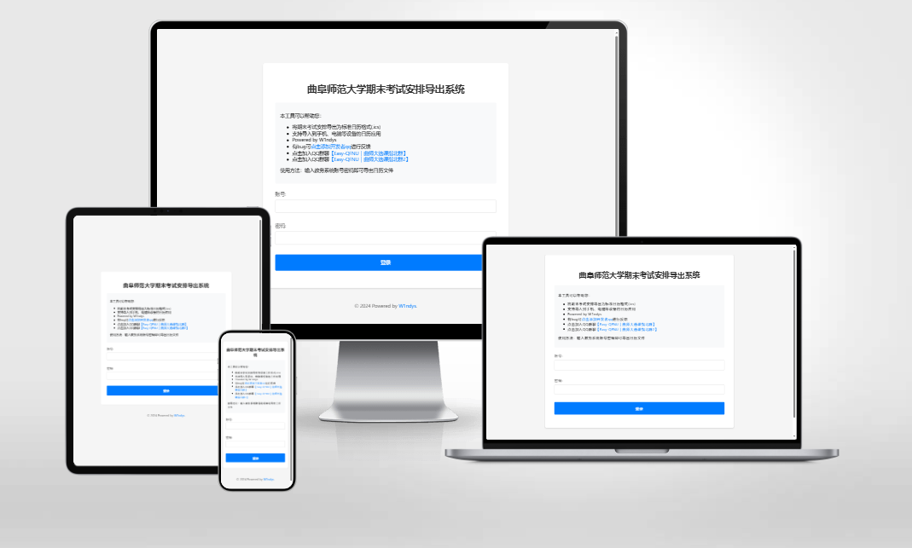

# QFNUExam2ics

曲阜师范大学教务系统（强智教务）读取考试安排，并生成 ics 文件，便于导入到日历中



## 目录
- [使用](#使用)
  - [控制台运行](#控制台运行)
  - [网页版](#网页版)
  - [Docker](#docker)

## 使用

### 控制台运行

1. **克隆项目**
   ```bash
   git clone https://github.com/W1ndys/QFNUExam2ics.git
   ```

2. **安装依赖**
   ```bash
   pip install -r requirements.txt
   ```

3. **运行脚本**
   ```bash
   python main.py
   ```

### 网页版

1. **安装依赖**
   ```bash
   pip install -r requirements.txt
   ```

2. **运行脚本**
   ```bash
   python webserver.py
   ```

3. **访问网页**
   ```bash
   http://127.0.0.1:5000
   ```

### Docker

根据你的系统选择构建运行脚本，这里以 Linux 为例：

1. **构建并运行**
   ```bash
   sh linux_build_and_run.sh
   ```

2. **访问服务**
   - 本地访问: `http://localhost:5000`
   - 服务器公网访问: `http://ip:5000`